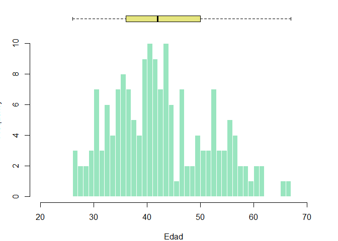
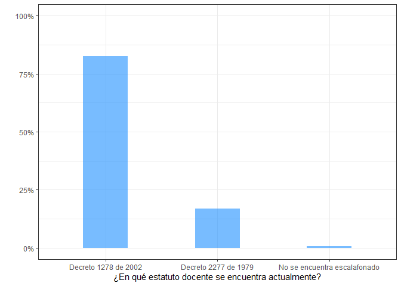

Análisis exploratorio de datos
================
Brayam Pineda

# Librerias

``` r
library(dplyr)
library(googlesheets4)
library(ggplot2)
library(scales)
library(tidyverse)
```

# Datos

Debido a que la información es confidencial no se publica el código ni
el *head()* acostumbrado.

Los datos consisten en las respuetas de los docentes interesados en el
proyecto a una escala

## Sexo

``` r
table(data$Sexo)
```

    ## 
    ##            Femenino           Masculino Prefiero no decirlo 
    ##                  50                  25                   2

``` r
data_sexo = data %>% select(Sexo) %>% group_by(Sexo) %>% tally()
```

    ## Adding missing grouping variables: `Número de identificación`

``` r
data_sexo$Porcentaje = data_sexo$n / sum(data_sexo$n) 

ggplot(data = data_sexo, aes(x = Sexo, y = Porcentaje)) + 
  geom_bar(stat = "identity", fill="#f68060", alpha=.6, width=.4) +
  scale_y_continuous(labels = percent_format()) +
  ylab("") +
  theme_bw()
```

<!-- -->

## Edad

``` r
layout(mat = matrix(c(1,2),2,1, byrow=TRUE),  height = c(1,8))

par(mar=c(0, 3.1, 1.1, 2.1))
boxplot(data$`Edad (en años)`, horizontal=TRUE , ylim=c(20,60), xaxt="n" , col=rgb(0.8,0.8,0,0.5) , frame=F)
par(mar=c(4, 3.1, 1.1, 2.1))
hist(data$`Edad (en años)`, breaks=40, col=rgb(0.2,0.8,0.5,0.5) , border=F , main="" , xlab="Edad", xlim=c(20,60))
```

<!-- -->

## Edad por sexo

``` r
data_edad_sexo = data %>% select(Sexo, `Edad (en años)`) %>% filter(Sexo != "Prefiero no decirlo")
```

    ## Adding missing grouping variables: `Número de identificación`

``` r
ggplot(data = data_edad_sexo, aes(x = Sexo, y = `Edad (en años)`, fill = Sexo)) +
  geom_boxplot(alpha=0.7, width=.4) + 
  theme_bw()
```

    ## Warning: Removed 9 rows containing non-finite values (stat_boxplot).

<!-- -->

## Nivel educativo en el que enseña

``` r
data_nivel_educativo = data %>% separate(`Nivel educativo en el que labora`, into = paste("Nivel", 1:4),sep = ",")
```

    ## Warning: Expected 4 pieces. Additional pieces discarded in 1 rows [51].

    ## Warning: Expected 4 pieces. Missing pieces filled with `NA` in 74 rows [1, 2, 3,
    ## 4, 5, 6, 7, 8, 9, 10, 11, 12, 13, 14, 15, 16, 17, 18, 19, 20, ...].

``` r
data_nivel_educativo2 = data_nivel_educativo %>% select(`Número de identificación`, `Nivel 1`, `Nivel 2`, `Nivel 3`,`Nivel 4`) %>%
  pivot_longer(c(`Nivel 1`, `Nivel 2`, `Nivel 3`,`Nivel 4`), names_to = "Nivel educativo en el que labora")

data_nivel_educativo2$value <- chartr("áéíóú", "aeiou", data_nivel_educativo2$value)
data_nivel_educativo2$value <- str_to_upper(data_nivel_educativo2$value)
data_nivel_educativo2$value <- gsub("_", " ", data_nivel_educativo2$value)
data_nivel_educativo2$value <- gsub("  ", " ", data_nivel_educativo2$value)
data_nivel_educativo2$value <- gsub(" $", "", data_nivel_educativo2$value)
data_nivel_educativo2$value <- gsub("^ ", "", data_nivel_educativo2$value)


data_nivel_educativo3 = data_nivel_educativo2 %>% group_by(`value`) %>% 
  tally()

data_nivel_educativo3 = data_nivel_educativo3[complete.cases(data_nivel_educativo3[,1]), ]

data_nivel_educativo3$Porcentaje = data_nivel_educativo3$n / sum(data_nivel_educativo3$n)


data_nivel_educativo3 %>% arrange(Porcentaje) %>%    # First sort by val. This sort the dataframe but NOT the factor levels
  mutate(name=factor(value, levels=value)) %>%   # This trick update the factor levels
  ggplot(aes(x=name, y=Porcentaje)) +
  scale_y_continuous(labels = percent_format()) +
  geom_segment(aes(xend=name, yend=0)) +
  geom_point( size=4, color="orange") +
  coord_flip() +
  theme_bw() +
  xlab("")
```

<!-- -->

## Máximo nivel educativo alcanzado por los docentes

``` r
data_educacion_docente = data %>% select(`Número de identificación`, 
                                         `¿Cuál es su máximo nivel educativo? [Bachiller]`,
                                         `¿Cuál es su máximo nivel educativo? [Normalista superior]`,
                                         `¿Cuál es su máximo nivel educativo? [Técnico o tecnólogo]`,
                                         `¿Cuál es su máximo nivel educativo? [Profesional universitario]`,
                                         `¿Cuál es su máximo nivel educativo? [Especialización]`,
                                         `¿Cuál es su máximo nivel educativo? [Maestría]`,
                                         `¿Cuál es su máximo nivel educativo? [Doctorado]`) %>%
  pivot_longer(cols = 2:8, names_to = "Aprobación")

data_educacion_docente = data_educacion_docente[complete.cases(data_educacion_docente[, "value"]), ]
data_educacion_docente = data_educacion_docente[data_educacion_docente$value == "Aprobado", ]

data_educacion_docente$Aprobación = gsub("^¿Cuál es su máximo nivel educativo? *", "", data_educacion_docente$Aprobación)
data_educacion_docente$Aprobación = gsub("^[?[]", "", data_educacion_docente$Aprobación)
data_educacion_docente$Aprobación = gsub("\\[", "", data_educacion_docente$Aprobación)
data_educacion_docente$Aprobación = gsub("\\]", "", data_educacion_docente$Aprobación)
data_educacion_docente$Aprobación = gsub("^ ", "", data_educacion_docente$Aprobación)


data_educacion_docente = data_educacion_docente[order(data_educacion_docente$`Número de identificación`, data_educacion_docente$Aprobación), ]

data_educacion_docente$Nivel = data_educacion_docente$Aprobación

data_educacion_docente$Nivel = stringr::str_replace_all(pattern = c("Bachiller" = "1", 
                                                                    "Normalista superior" = "2", 
                                                                    "Técnico o tecnólogo" = "3", 
                                                                    "Profesional universitario" = "4", 
                                                                    "Especialización" = "5", 
                                                                    "Maestría" = "6"), data_educacion_docente$Nivel)

data_educacion_docente = data_educacion_docente %>% group_by(`Número de identificación`) %>%
  top_n(1, Nivel)

data_educacion_docente = data_educacion_docente %>% group_by(`Aprobación`) %>% tally()
data_educacion_docente$Porcentaje = data_educacion_docente$n / sum(data_educacion_docente$n)

ggplot(data = data_educacion_docente, aes(x = "", y = Porcentaje, fill = `Aprobación`)) +
  geom_bar(stat = "identity", width = 1) +
  scale_y_continuous(labels = percent_format()) +
  coord_polar("y", start = 0) +
  theme_void() + 
  
  geom_text(aes(y = Porcentaje, label = percent(Porcentaje)), color = "white", size=6, position=position_stack(vjust=0.5)) 
```

<!-- -->

## Estatuto docente

``` r
data_estatuto = data %>% select(`¿En qué estatuto docente se encuentra actualmente?`) %>% group_by(`¿En qué estatuto docente se encuentra actualmente?`) %>% tally()
```

    ## Adding missing grouping variables: `Número de identificación`

``` r
data_estatuto$Porcentaje = data_estatuto$n / sum(data_estatuto$n) 

ggplot(data = data_estatuto, aes(x = `¿En qué estatuto docente se encuentra actualmente?`, y = Porcentaje)) + 
  geom_bar(stat = "identity", fill="dodgerblue", alpha=.6, width=.4) +
  scale_y_continuous(labels = percent_format()) +
  ylab("") +
  theme_bw()
```

<!-- -->

## Departamento de origen

``` r
data_departamento = data %>% select(`Número de identificación`, Departamento)

data_departamento$Departamento <- chartr("áéíóú", "aeiou", data_departamento$Departamento)
data_departamento$Departamento <- str_to_upper(data_departamento$Departamento)
data_departamento$Departamento <- gsub("_", " ", data_departamento$Departamento)
data_departamento$Departamento <- gsub("  ", " ", data_departamento$Departamento)
data_departamento$Departamento <- gsub(" $", "", data_departamento$Departamento)
data_departamento$Departamento <- gsub("^ ", "", data_departamento$Departamento)
data_departamento$Departamento <- chartr("ÁÉÍÓÚ", "AEIOU", data_departamento$Departamento)
data_departamento$Departamento <- chartr("À", "A", data_departamento$Departamento)
data_departamento$Departamento <- gsub("VALLE$", "VALLE DEL CAUCA", data_departamento$Departamento)

data_departamento2 = data_departamento %>% group_by(`Departamento`) %>% 
  tally()

data_departamento2 = data_departamento2[complete.cases(data_departamento2[,1]), ]

data_departamento2$Porcentaje = data_departamento2$n / sum(data_departamento2$n)


data_departamento2 %>% arrange(Porcentaje) %>%    # First sort by val. This sort the dataframe but NOT the factor levels
  mutate(name=factor(Departamento, levels=Departamento)) %>%   # This trick update the factor levels
  ggplot(aes(x=name, y=Porcentaje)) +
  scale_y_continuous(labels = percent_format()) +
  geom_segment(aes(xend=name, yend=0)) +
  geom_point( size=4, color="indianred1") +
  coord_flip() +
  theme_bw() +
  xlab("")
```

<!-- -->

## Rol dentro de la institución

``` r
data_rol = data %>% select(`Número de identificación`, `Rol en su comunidad educativa`)

data_rol$`Rol en su comunidad educativa` = gsub("Docente Tutor PTA", "Tutor PTA", data_rol$`Rol en su comunidad educativa`)

data_rol = data_rol %>% group_by(`Rol en su comunidad educativa`) %>% tally()

data_rol$Porcentaje = data_rol$n / sum(data_rol$n)

data_rol %>% arrange(Porcentaje) %>%    # First sort by val. This sort the dataframe but NOT the factor levels
  mutate(name=factor(`Rol en su comunidad educativa`, levels=`Rol en su comunidad educativa`)) %>%   # This trick update the factor levels
  ggplot(aes(x=name, y=Porcentaje)) +
  geom_bar(stat = "identity", fill="lightpink2", alpha=.6, width=.4) +
  scale_y_continuous(labels = percent_format()) +
  ylab("") +
  theme_bw()
```

<!-- -->
