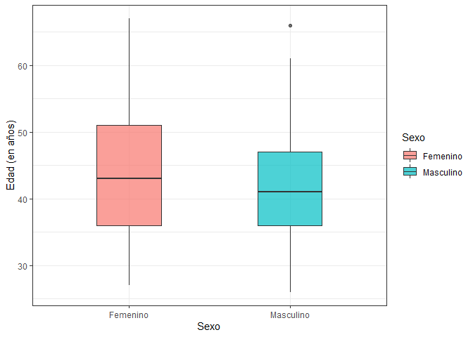
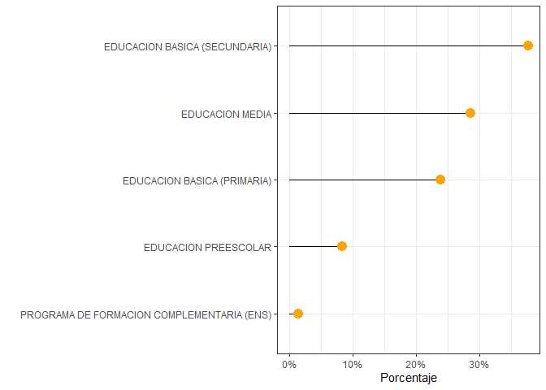

Análisis exploratorio de datos
================
Brayam Pineda

# Librerias

``` r
library(dplyr)
library(googlesheets4)
library(ggplot2)
library(scales)
library(tidyverse)
```

# Datos

Debido a que la información es confidencial no se publica el código ni
el *head()* acostumbrado.

Los datos consisten en las respuetas de los docentes interesados en el
proyecto a una escala

## Sexo

``` r
table(data$Sexo)
```

    ## 
    ##            Femenino           Masculino Prefiero no decirlo 
    ##                  31                  18                   2

``` r
data_sexo = data %>% select(Sexo) %>% group_by(Sexo) %>% tally()
data_sexo$Porcentaje = data_sexo$n / sum(data_sexo$n) 

ggplot(data = data_sexo, aes(x = Sexo, y = Porcentaje)) + 
  geom_bar(stat = "identity", fill="#f68060", alpha=.6, width=.4) +
  scale_y_continuous(labels = percent_format()) +
  ylab("") +
  theme_bw()
```

<!-- -->

## Edad

``` r
layout(mat = matrix(c(1,2),2,1, byrow=TRUE),  height = c(1,8))

par(mar=c(0, 3.1, 1.1, 2.1))
boxplot(data$`Edad (en años)`, horizontal=TRUE , ylim=c(20,60), xaxt="n" , col=rgb(0.8,0.8,0,0.5) , frame=F)
par(mar=c(4, 3.1, 1.1, 2.1))
hist(data$`Edad (en años)`, breaks=40, col=rgb(0.2,0.8,0.5,0.5) , border=F , main="" , xlab="Edad", xlim=c(20,60))
```

<!-- -->

## Edad por sexo

``` r
data_edad_sexo = data %>% select(Sexo, `Edad (en años)`) %>% filter(Sexo != "Prefiero no decirlo")

ggplot(data = data_edad_sexo, aes(x = Sexo, y = `Edad (en años)`, fill = Sexo)) +
  geom_boxplot(alpha=0.7, width=.4) + 
  theme_bw()
```

    ## Warning: Removed 7 rows containing non-finite values (stat_boxplot).

<!-- -->

## Nivel educativo en el que enseña

``` r
data_nivel_educativo = data %>% separate(`Nivel educativo en el que labora`, into = paste("Nivel", 1:4),sep = ",")
```

    ## Warning: Expected 4 pieces. Missing pieces filled with `NA` in 50 rows [1, 2, 3,
    ## 4, 5, 6, 7, 8, 9, 10, 11, 12, 13, 14, 15, 16, 17, 18, 19, 20, ...].

``` r
data_nivel_educativo2 = data_nivel_educativo %>% select(`Número de identificación`, `Nivel 1`, `Nivel 2`, `Nivel 3`,`Nivel 4`) %>%
  pivot_longer(c(`Nivel 1`, `Nivel 2`, `Nivel 3`,`Nivel 4`), names_to = "Nivel educativo en el que labora")

data_nivel_educativo2$value <- chartr("áéíóú", "aeiou", data_nivel_educativo2$value)
data_nivel_educativo2$value <- str_to_upper(data_nivel_educativo2$value)
data_nivel_educativo2$value <- gsub("_", " ", data_nivel_educativo2$value)
data_nivel_educativo2$value <- gsub("  ", " ", data_nivel_educativo2$value)
data_nivel_educativo2$value <- gsub(" $", "", data_nivel_educativo2$value)
data_nivel_educativo2$value <- gsub("^ ", "", data_nivel_educativo2$value)


data_nivel_educativo3 = data_nivel_educativo2 %>% group_by(`value`) %>% 
  tally()

data_nivel_educativo3 = data_nivel_educativo3[complete.cases(data_nivel_educativo3[,1]), ]

data_nivel_educativo3$Porcentaje = data_nivel_educativo3$n / sum(data_nivel_educativo3$n)


data_nivel_educativo3 %>% arrange(Porcentaje) %>%    # First sort by val. This sort the dataframe but NOT the factor levels
  mutate(name=factor(value, levels=value)) %>%   # This trick update the factor levels
  ggplot(aes(x=name, y=Porcentaje)) +
  scale_y_continuous(labels = percent_format()) +
  geom_segment(aes(xend=name, yend=0)) +
  geom_point( size=4, color="orange") +
  coord_flip() +
  theme_bw() +
  xlab("")
```

<!-- -->
