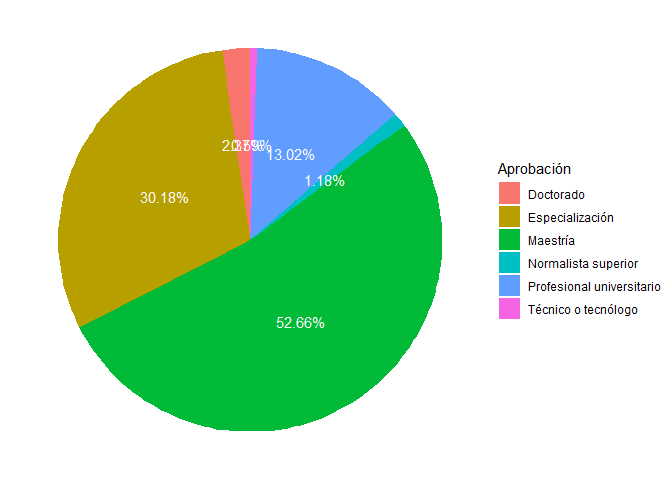
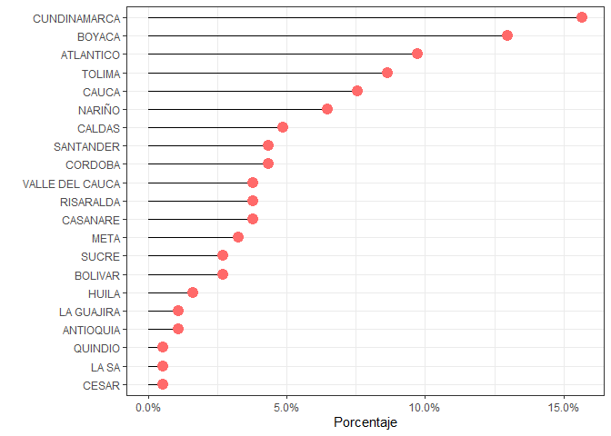
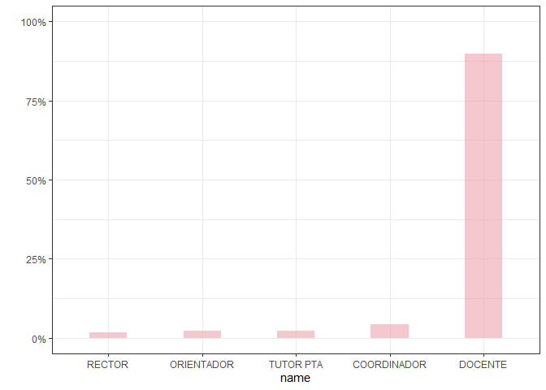
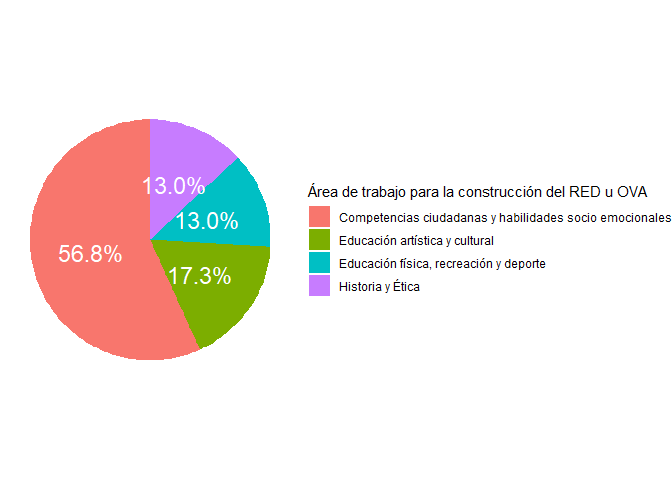
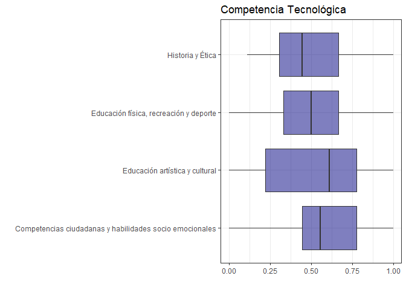
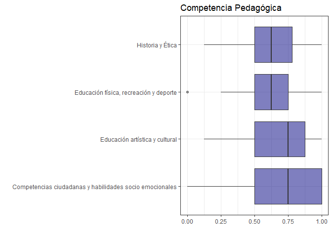
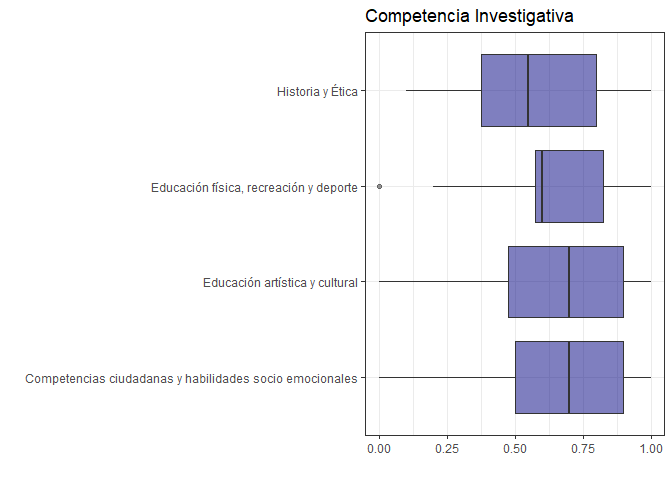

Análisis exploratorio de datos
================
Brayam Pineda

# Librerias

``` r
library(dplyr)
library(googlesheets4)
library(ggplot2)
library(scales)
library(tidyverse)
```

# Datos

Debido a que la información es confidencial no se publica el código ni
el *head()* acostumbrado.

Los datos consisten en las respuetas de los docentes interesados en el
proyecto a una escala

## Sexo

``` r
table(data$Sexo)
```

    ## 
    ##            Femenino           Masculino Prefiero no decirlo 
    ##                  72                  32                   2

``` r
data_sexo = data %>% select(Sexo) %>% group_by(Sexo) %>% tally()
```

    ## Adding missing grouping variables: `Número de identificación`

``` r
data_sexo$Porcentaje = data_sexo$n / sum(data_sexo$n) 

ggplot(data = data_sexo, aes(x = Sexo, y = Porcentaje)) + 
  geom_bar(stat = "identity", fill="#f68060", alpha=.6, width=.4) +
  scale_y_continuous(labels = percent_format()) +
  ylab("") +
  theme_bw()
```

<!-- -->

## Edad

``` r
layout(mat = matrix(c(1,2),2,1, byrow=TRUE),  height = c(1,8))

par(mar=c(0, 3.1, 1.1, 2.1))
boxplot(data$`Edad (en años)`, horizontal=TRUE , ylim=c(20,60), xaxt="n" , col=rgb(0.8,0.8,0,0.5) , frame=F)
par(mar=c(4, 3.1, 1.1, 2.1))
hist(data$`Edad (en años)`, breaks=40, col=rgb(0.2,0.8,0.5,0.5) , border=F , main="" , xlab="Edad", xlim=c(20,60))
```

<!-- -->

## Edad por sexo

``` r
data_edad_sexo = data %>% select(Sexo, `Edad (en años)`) %>% filter(Sexo != "Prefiero no decirlo")
```

    ## Adding missing grouping variables: `Número de identificación`

``` r
ggplot(data = data_edad_sexo, aes(x = Sexo, y = `Edad (en años)`, fill = Sexo)) +
  geom_boxplot(alpha=0.7, width=.4) + 
  theme_bw()
```

    ## Warning: Removed 12 rows containing non-finite values (stat_boxplot).

<!-- -->

## Nivel educativo en el que enseña

``` r
data_nivel_educativo = data %>% separate(`Nivel educativo en el que labora`, into = paste("Nivel", 1:4),sep = ",")
```

    ## Warning: Expected 4 pieces. Additional pieces discarded in 2 rows [50, 105].

    ## Warning: Expected 4 pieces. Missing pieces filled with `NA` in 101 rows [1, 2,
    ## 3, 4, 5, 6, 7, 8, 9, 10, 11, 12, 13, 14, 15, 16, 17, 18, 19, 20, ...].

``` r
data_nivel_educativo2 = data_nivel_educativo %>% select(`Número de identificación`, `Nivel 1`, `Nivel 2`, `Nivel 3`,`Nivel 4`) %>%
  pivot_longer(c(`Nivel 1`, `Nivel 2`, `Nivel 3`,`Nivel 4`), names_to = "Nivel educativo en el que labora")

data_nivel_educativo2$value <- chartr("áéíóú", "aeiou", data_nivel_educativo2$value)
data_nivel_educativo2$value <- str_to_upper(data_nivel_educativo2$value)
data_nivel_educativo2$value <- gsub("_", " ", data_nivel_educativo2$value)
data_nivel_educativo2$value <- gsub("  ", " ", data_nivel_educativo2$value)
data_nivel_educativo2$value <- gsub(" $", "", data_nivel_educativo2$value)
data_nivel_educativo2$value <- gsub("^ ", "", data_nivel_educativo2$value)


data_nivel_educativo3 = data_nivel_educativo2 %>% group_by(`value`) %>% 
  tally()

data_nivel_educativo3 = data_nivel_educativo3[complete.cases(data_nivel_educativo3[,1]), ]

data_nivel_educativo3$Porcentaje = data_nivel_educativo3$n / sum(data_nivel_educativo3$n)


data_nivel_educativo3 %>% arrange(Porcentaje) %>%    # First sort by val. This sort the dataframe but NOT the factor levels
  mutate(name=factor(value, levels=value)) %>%   # This trick update the factor levels
  ggplot(aes(x=name, y=Porcentaje)) +
  scale_y_continuous(labels = percent_format()) +
  geom_segment(aes(xend=name, yend=0)) +
  geom_point( size=4, color="orange") +
  coord_flip() +
  theme_bw() +
  xlab("")
```

<!-- -->

## Máximo nivel educativo alcanzado por los docentes

``` r
data_educacion_docente = data %>% select(`Número de identificación`, 
                                         `¿Cuál es su máximo nivel educativo? [Bachiller]`,
                                         `¿Cuál es su máximo nivel educativo? [Normalista superior]`,
                                         `¿Cuál es su máximo nivel educativo? [Técnico o tecnólogo]`,
                                         `¿Cuál es su máximo nivel educativo? [Profesional universitario]`,
                                         `¿Cuál es su máximo nivel educativo? [Especialización]`,
                                         `¿Cuál es su máximo nivel educativo? [Maestría]`,
                                         `¿Cuál es su máximo nivel educativo? [Doctorado]`) %>%
  pivot_longer(cols = 2:8, names_to = "Aprobación")

data_educacion_docente = data_educacion_docente[complete.cases(data_educacion_docente[, "value"]), ]
data_educacion_docente = data_educacion_docente[data_educacion_docente$value == "Aprobado", ]

data_educacion_docente$Aprobación = gsub("^¿Cuál es su máximo nivel educativo? *", "", data_educacion_docente$Aprobación)
data_educacion_docente$Aprobación = gsub("^[?[]", "", data_educacion_docente$Aprobación)
data_educacion_docente$Aprobación = gsub("\\[", "", data_educacion_docente$Aprobación)
data_educacion_docente$Aprobación = gsub("\\]", "", data_educacion_docente$Aprobación)
data_educacion_docente$Aprobación = gsub("^ ", "", data_educacion_docente$Aprobación)


data_educacion_docente = data_educacion_docente[order(data_educacion_docente$`Número de identificación`, data_educacion_docente$Aprobación), ]

data_educacion_docente$Nivel = data_educacion_docente$Aprobación

data_educacion_docente$Nivel = stringr::str_replace_all(pattern = c("Bachiller" = "1", 
                                                                    "Normalista superior" = "2", 
                                                                    "Técnico o tecnólogo" = "3", 
                                                                    "Profesional universitario" = "4", 
                                                                    "Especialización" = "5", 
                                                                    "Maestría" = "6"), data_educacion_docente$Nivel)

data_educacion_docente = data_educacion_docente %>% group_by(`Número de identificación`) %>%
  top_n(1, Nivel)

data_educacion_docente = data_educacion_docente %>% group_by(`Aprobación`) %>% tally()
data_educacion_docente$Porcentaje = data_educacion_docente$n / sum(data_educacion_docente$n)

ggplot(data = data_educacion_docente, aes(x = "", y = Porcentaje, fill = `Aprobación`)) +
  geom_bar(stat = "identity", width = 1) +
  scale_y_continuous(labels = percent_format()) +
  coord_polar("y", start = 0) +
  theme_void() + 
  
  geom_text(aes(y = Porcentaje, label = percent(Porcentaje)), color = "white", size=6, position=position_stack(vjust=0.5)) 
```

<!-- -->

## Estatuto docente

``` r
data_estatuto = data %>% select(`¿En qué estatuto docente se encuentra actualmente?`) %>% group_by(`¿En qué estatuto docente se encuentra actualmente?`) %>% tally()
```

    ## Adding missing grouping variables: `Número de identificación`

``` r
data_estatuto$Porcentaje = data_estatuto$n / sum(data_estatuto$n) 

ggplot(data = data_estatuto, aes(x = `¿En qué estatuto docente se encuentra actualmente?`, y = Porcentaje)) + 
  geom_bar(stat = "identity", fill="dodgerblue", alpha=.6, width=.4) +
  scale_y_continuous(labels = percent_format()) +
  ylab("") +
  theme_bw()
```

<!-- -->

## Departamento de origen

``` r
data_departamento = data %>% select(`Número de identificación`, Departamento)

data_departamento$Departamento <- chartr("áéíóú", "aeiou", data_departamento$Departamento)
data_departamento$Departamento <- str_to_upper(data_departamento$Departamento)
data_departamento$Departamento <- gsub("_", " ", data_departamento$Departamento)
data_departamento$Departamento <- gsub("  ", " ", data_departamento$Departamento)
data_departamento$Departamento <- gsub(" $", "", data_departamento$Departamento)
data_departamento$Departamento <- gsub("^ ", "", data_departamento$Departamento)
data_departamento$Departamento <- chartr("ÁÉÍÓÚ", "AEIOU", data_departamento$Departamento)
data_departamento$Departamento <- chartr("À", "A", data_departamento$Departamento)
data_departamento$Departamento <- gsub("VALLE$", "VALLE DEL CAUCA", data_departamento$Departamento)

data_departamento2 = data_departamento %>% group_by(`Departamento`) %>% 
  tally()

data_departamento2 = data_departamento2[complete.cases(data_departamento2[,1]), ]

data_departamento2$Porcentaje = data_departamento2$n / sum(data_departamento2$n)


data_departamento2 %>% arrange(Porcentaje) %>%    # First sort by val. This sort the dataframe but NOT the factor levels
  mutate(name=factor(Departamento, levels=Departamento)) %>%   # This trick update the factor levels
  ggplot(aes(x=name, y=Porcentaje)) +
  scale_y_continuous(labels = percent_format()) +
  geom_segment(aes(xend=name, yend=0)) +
  geom_point( size=4, color="indianred1") +
  coord_flip() +
  theme_bw() +
  xlab("")
```

<!-- -->

## Rol dentro de la institución

``` r
data_rol = data %>% select(`Número de identificación`, `Rol en su comunidad educativa`)

data_rol$`Rol en su comunidad educativa` = gsub("Docente Tutor PTA", "Tutor PTA", data_rol$`Rol en su comunidad educativa`)

data_rol = data_rol %>% group_by(`Rol en su comunidad educativa`) %>% tally()

data_rol$Porcentaje = data_rol$n / sum(data_rol$n)

data_rol %>% arrange(Porcentaje) %>%    # First sort by val. This sort the dataframe but NOT the factor levels
  mutate(name=factor(`Rol en su comunidad educativa`, levels=`Rol en su comunidad educativa`)) %>%   # This trick update the factor levels
  ggplot(aes(x=name, y=Porcentaje)) +
  geom_bar(stat = "identity", fill="lightpink2", alpha=.6, width=.4) +
  scale_y_continuous(labels = percent_format()) +
  ylab("") +
  theme_bw()
```

<!-- -->

## Área de trabajo para la construcción del RED u OVA

``` r
data_asignatura = data %>% group_by(`Área de trabajo para la construcción del RED u OVA`) %>% tally()
data_asignatura$Porcentaje = data_asignatura$n / sum(data_asignatura$n)

ggplot(data = data_asignatura, aes(x = "", y = Porcentaje, fill = `Área de trabajo para la construcción del RED u OVA`)) +
  geom_bar(stat = "identity", width = 1) +
  scale_y_continuous(labels = percent_format()) +
  coord_polar("y", start = 0) +
  theme_void() + 
  
  geom_text(aes(y = Porcentaje, label = percent(Porcentaje)), color = "white", size=6, position=position_stack(vjust=0.5)) 
```

<!-- -->

# Análisis Exploratorio de la Escala de Competencias TIC

## Exploración de las variables

``` r
summary(data[ ,(length(colnames(data))-13):(length(colnames(data)))])
```

    ##  [Busco, ordeno, filtro, conecto y analizo información de internet con el fin de facilitar mis procesos de investigación.]
    ##  Min.   :0.000                                                                                                            
    ##  1st Qu.:1.000                                                                                                            
    ##  Median :2.000                                                                                                            
    ##  Mean   :1.648                                                                                                            
    ##  3rd Qu.:2.000                                                                                                            
    ##  Max.   :2.000                                                                                                            
    ##  NA's   :1                                                                                                                
    ##  [Represento e interpreto datos e información de mis investigaciones en diversos formatos digitales.]
    ##  Min.   :0.000                                                                                       
    ##  1st Qu.:1.000                                                                                       
    ##  Median :1.000                                                                                       
    ##  Mean   :1.324                                                                                       
    ##  3rd Qu.:2.000                                                                                       
    ##  Max.   :2.000                                                                                       
    ##  NA's   :1                                                                                           
    ##  [Divulgo los resultados de mis investigaciones utilizando herramientas TIC tales como blogs, videos, presentaciones, infografías, redes sociales, entre otros.]
    ##  Min.   :0.000                                                                                                                                                  
    ##  1st Qu.:1.000                                                                                                                                                  
    ##  Median :1.000                                                                                                                                                  
    ##  Mean   :1.362                                                                                                                                                  
    ##  3rd Qu.:2.000                                                                                                                                                  
    ##  Max.   :2.000                                                                                                                                                  
    ##  NA's   :1                                                                                                                                                      
    ##  [Elaboro soluciones tecnológicas innovadoras para las problemáticas que he investigado en mi entorno.]
    ##  Min.   :0.000                                                                                         
    ##  1st Qu.:1.000                                                                                         
    ##  Median :1.000                                                                                         
    ##  Mean   :1.057                                                                                         
    ##  3rd Qu.:2.000                                                                                         
    ##  Max.   :2.000                                                                                         
    ##  NA's   :1                                                                                             
    ##  [Participo activamente en redes y comunidades de práctica, para la construcción colectiva de conocimientos con estudiantes y colegas con el apoyo de TIC.]
    ##  Min.   :0.000                                                                                                                                             
    ##  1st Qu.:1.000                                                                                                                                             
    ##  Median :1.000                                                                                                                                             
    ##  Mean   :1.238                                                                                                                                             
    ##  3rd Qu.:2.000                                                                                                                                             
    ##  Max.   :2.000                                                                                                                                             
    ##  NA's   :1                                                                                                                                                 
    ##  [Participo en procesos de formación en mi área y/o disciplina utilizando TIC]
    ##  Min.   :0.000                                                                
    ##  1st Qu.:1.000                                                                
    ##  Median :2.000                                                                
    ##  Mean   :1.533                                                                
    ##  3rd Qu.:2.000                                                                
    ##  Max.   :2.000                                                                
    ##  NA's   :1                                                                    
    ##  [Incentivo en mis estudiantes el aprendizaje autónomo y colaborativo apoyados por TIC.]
    ##  Min.   :0.000                                                                          
    ##  1st Qu.:1.000                                                                          
    ##  Median :2.000                                                                          
    ##  Mean   :1.514                                                                          
    ##  3rd Qu.:2.000                                                                          
    ##  Max.   :2.000                                                                          
    ##  NA's   :1                                                                              
    ##  [Hago seguimiento, retroalimentación y reconozco oportunidades de mejora de las implementaciones de estrategias que hacen uso de las TIC.]
    ##  Min.   :0.000                                                                                                                             
    ##  1st Qu.:1.000                                                                                                                             
    ##  Median :1.000                                                                                                                             
    ##  Mean   :1.337                                                                                                                             
    ##  3rd Qu.:2.000                                                                                                                             
    ##  Max.   :2.000                                                                                                                             
    ##  NA's   :2                                                                                                                                 
    ##  [Construyo planes curriculares o proyectos pedagógicos mediados por las TIC de acuerdo con el desarrollo cognitivo, físico, psicológico y social de mis estudiantes.]
    ##  Min.   :0.000                                                                                                                                                        
    ##  1st Qu.:1.000                                                                                                                                                        
    ##  Median :1.000                                                                                                                                                        
    ##  Mean   :1.245                                                                                                                                                        
    ##  3rd Qu.:2.000                                                                                                                                                        
    ##  Max.   :2.000                                                                                                                                                        
    ##                                                                                                                                                                       
    ##  [Logro identificar las características, usos y oportunidades que ofrecen las herramientas teconológicas en los procesos educativos.]
    ##  Min.   :0.000                                                                                                                       
    ##  1st Qu.:1.000                                                                                                                       
    ##  Median :2.000                                                                                                                       
    ##  Mean   :1.581                                                                                                                       
    ##  3rd Qu.:2.000                                                                                                                       
    ##  Max.   :2.000                                                                                                                       
    ##  NA's   :1                                                                                                                           
    ##  [Utilizo diversas herramientas tecnológicas para mejorar la planeación y evaluación de mis prácticas educativas.]
    ##  Min.   :       0                                                                                                 
    ##  1st Qu.:       1                                                                                                 
    ##  Median :       2                                                                                                 
    ##  Mean   :  285652                                                                                                 
    ##  3rd Qu.:       2                                                                                                 
    ##  Max.   :29993288                                                                                                 
    ##  NA's   :1                                                                                                        
    ##  [Promuevo el uso de plataformas digitales y portales web dando énfasis a sus lógicas y características propias.]
    ##  Min.   :0.000                                                                                                   
    ##  1st Qu.:1.000                                                                                                   
    ##  Median :1.000                                                                                                   
    ##  Mean   :1.324                                                                                                   
    ##  3rd Qu.:2.000                                                                                                   
    ##  Max.   :2.000                                                                                                   
    ##  NA's   :1                                                                                                       
    ##  [Diseño y publico recursos educativos u objetivos virtuales de aprendizaje en plataformas digitales.]
    ##  Min.   :0.0000                                                                                       
    ##  1st Qu.:0.0000                                                                                       
    ##  Median :1.0000                                                                                       
    ##  Mean   :0.8857                                                                                       
    ##  3rd Qu.:1.0000                                                                                       
    ##  Max.   :2.0000                                                                                       
    ##  NA's   :1                                                                                            
    ##  [Diseño ambientes de aprendizaje haciendo uso de lenguajes, interfaces y otras herramientas tecnológicas.]
    ##  Min.   :0.0000                                                                                            
    ##  1st Qu.:0.0000                                                                                            
    ##  Median :1.0000                                                                                            
    ##  Mean   :0.8857                                                                                            
    ##  3rd Qu.:1.0000                                                                                            
    ##  Max.   :2.0000                                                                                            
    ##  NA's   :1

### Quitando ourliers

``` r
replaceOutliers = function(x) {
  q1 = quantile(x, na.rm = TRUE, 0.25)
  q3 = quantile(x, na.rm = TRUE, 0.75)
  x[x < q1] = median(x, na.rm = TRUE)
  x[x > q3] = median(x, na.rm = TRUE)
  x[is.na(x)] = median(x, na.rm = TRUE)
  x
}

outliers_out = apply(data[ ,(length(colnames(data))-13):(length(colnames(data)))], 2, replaceOutliers)
data_v2 = data
data_v2[ ,(length(colnames(data_v2))-13):(length(colnames(data_v2)))] = outliers_out
summary(data_v2[ ,(length(colnames(data_v2))-13):(length(colnames(data_v2)))])
```

    ##  [Busco, ordeno, filtro, conecto y analizo información de internet con el fin de facilitar mis procesos de investigación.]
    ##  Min.   :1.000                                                                                                            
    ##  1st Qu.:1.250                                                                                                            
    ##  Median :2.000                                                                                                            
    ##  Mean   :1.745                                                                                                            
    ##  3rd Qu.:2.000                                                                                                            
    ##  Max.   :2.000                                                                                                            
    ##  [Represento e interpreto datos e información de mis investigaciones en diversos formatos digitales.]
    ##  Min.   :1.000                                                                                       
    ##  1st Qu.:1.000                                                                                       
    ##  Median :1.000                                                                                       
    ##  Mean   :1.425                                                                                       
    ##  3rd Qu.:2.000                                                                                       
    ##  Max.   :2.000                                                                                       
    ##  [Divulgo los resultados de mis investigaciones utilizando herramientas TIC tales como blogs, videos, presentaciones, infografías, redes sociales, entre otros.]
    ##  Min.   :1.000                                                                                                                                                  
    ##  1st Qu.:1.000                                                                                                                                                  
    ##  Median :1.000                                                                                                                                                  
    ##  Mean   :1.453                                                                                                                                                  
    ##  3rd Qu.:2.000                                                                                                                                                  
    ##  Max.   :2.000                                                                                                                                                  
    ##  [Elaboro soluciones tecnológicas innovadoras para las problemáticas que he investigado en mi entorno.]
    ##  Min.   :1.000                                                                                         
    ##  1st Qu.:1.000                                                                                         
    ##  Median :1.000                                                                                         
    ##  Mean   :1.255                                                                                         
    ##  3rd Qu.:1.750                                                                                         
    ##  Max.   :2.000                                                                                         
    ##  [Participo activamente en redes y comunidades de práctica, para la construcción colectiva de conocimientos con estudiantes y colegas con el apoyo de TIC.]
    ##  Min.   :1.000                                                                                                                                             
    ##  1st Qu.:1.000                                                                                                                                             
    ##  Median :1.000                                                                                                                                             
    ##  Mean   :1.415                                                                                                                                             
    ##  3rd Qu.:2.000                                                                                                                                             
    ##  Max.   :2.000                                                                                                                                             
    ##  [Participo en procesos de formación en mi área y/o disciplina utilizando TIC]
    ##  Min.   :1.000                                                                
    ##  1st Qu.:1.000                                                                
    ##  Median :2.000                                                                
    ##  Mean   :1.613                                                                
    ##  3rd Qu.:2.000                                                                
    ##  Max.   :2.000                                                                
    ##  [Incentivo en mis estudiantes el aprendizaje autónomo y colaborativo apoyados por TIC.]
    ##  Min.   :1.000                                                                          
    ##  1st Qu.:1.000                                                                          
    ##  Median :2.000                                                                          
    ##  Mean   :1.651                                                                          
    ##  3rd Qu.:2.000                                                                          
    ##  Max.   :2.000                                                                          
    ##  [Hago seguimiento, retroalimentación y reconozco oportunidades de mejora de las implementaciones de estrategias que hacen uso de las TIC.]
    ##  Min.   :1.000                                                                                                                             
    ##  1st Qu.:1.000                                                                                                                             
    ##  Median :1.000                                                                                                                             
    ##  Mean   :1.396                                                                                                                             
    ##  3rd Qu.:2.000                                                                                                                             
    ##  Max.   :2.000                                                                                                                             
    ##  [Construyo planes curriculares o proyectos pedagógicos mediados por las TIC de acuerdo con el desarrollo cognitivo, físico, psicológico y social de mis estudiantes.]
    ##  Min.   :1.00                                                                                                                                                         
    ##  1st Qu.:1.00                                                                                                                                                         
    ##  Median :1.00                                                                                                                                                         
    ##  Mean   :1.34                                                                                                                                                         
    ##  3rd Qu.:2.00                                                                                                                                                         
    ##  Max.   :2.00                                                                                                                                                         
    ##  [Logro identificar las características, usos y oportunidades que ofrecen las herramientas teconológicas en los procesos educativos.]
    ##  Min.   :1.000                                                                                                                       
    ##  1st Qu.:1.000                                                                                                                       
    ##  Median :2.000                                                                                                                       
    ##  Mean   :1.604                                                                                                                       
    ##  3rd Qu.:2.000                                                                                                                       
    ##  Max.   :2.000                                                                                                                       
    ##  [Utilizo diversas herramientas tecnológicas para mejorar la planeación y evaluación de mis prácticas educativas.]
    ##  Min.   :1.000                                                                                                    
    ##  1st Qu.:1.000                                                                                                    
    ##  Median :2.000                                                                                                    
    ##  Mean   :1.547                                                                                                    
    ##  3rd Qu.:2.000                                                                                                    
    ##  Max.   :2.000                                                                                                    
    ##  [Promuevo el uso de plataformas digitales y portales web dando énfasis a sus lógicas y características propias.]
    ##  Min.   :1.000                                                                                                   
    ##  1st Qu.:1.000                                                                                                   
    ##  Median :1.000                                                                                                   
    ##  Mean   :1.425                                                                                                   
    ##  3rd Qu.:2.000                                                                                                   
    ##  Max.   :2.000                                                                                                   
    ##  [Diseño y publico recursos educativos u objetivos virtuales de aprendizaje en plataformas digitales.]
    ##  Min.   :0.0000                                                                                       
    ##  1st Qu.:0.0000                                                                                       
    ##  Median :1.0000                                                                                       
    ##  Mean   :0.6887                                                                                       
    ##  3rd Qu.:1.0000                                                                                       
    ##  Max.   :1.0000                                                                                       
    ##  [Diseño ambientes de aprendizaje haciendo uso de lenguajes, interfaces y otras herramientas tecnológicas.]
    ##  Min.   :0.0000                                                                                            
    ##  1st Qu.:0.0000                                                                                            
    ##  Median :1.0000                                                                                            
    ##  Mean   :0.6792                                                                                            
    ##  3rd Qu.:1.0000                                                                                            
    ##  Max.   :1.0000

## Calificación de las escalas

``` r
data_v2$Comp_Investigativa = data_v2$`[Busco, ordeno, filtro, conecto y analizo información de internet con el fin de facilitar mis procesos de investigación.]` +
  data_v2$`[Represento e interpreto datos e información de mis investigaciones en diversos formatos digitales.]` +
  data_v2$`[Divulgo los resultados de mis investigaciones utilizando herramientas TIC tales como blogs, videos, presentaciones, infografías, redes sociales, entre otros.]` +
  data_v2$`[Elaboro soluciones tecnológicas innovadoras para las problemáticas que he investigado en mi entorno.]` +
  data_v2$`[Participo activamente en redes y comunidades de práctica, para la construcción colectiva de conocimientos con estudiantes y colegas con el apoyo de TIC.]`

data_v2$Comp_Pedagogica = data_v2$`[Participo en procesos de formación en mi área y/o disciplina utilizando TIC]` +
  data_v2$`[Incentivo en mis estudiantes el aprendizaje autónomo y colaborativo apoyados por TIC.]` +
  data_v2$`[Hago seguimiento, retroalimentación y reconozco oportunidades de mejora de las implementaciones de estrategias que hacen uso de las TIC.]` +
  data_v2$`[Construyo planes curriculares o proyectos pedagógicos mediados por las TIC de acuerdo con el desarrollo cognitivo, físico, psicológico y social de mis estudiantes.]`

data_v2$Comp_Tecnologica = data_v2$`[Logro identificar las características, usos y oportunidades que ofrecen las herramientas teconológicas en los procesos educativos.]` +
  data_v2$`[Utilizo diversas herramientas tecnológicas para mejorar la planeación y evaluación de mis prácticas educativas.]` +
  data_v2$`[Promuevo el uso de plataformas digitales y portales web dando énfasis a sus lógicas y características propias.]` +
  data_v2$`[Diseño y publico recursos educativos u objetivos virtuales de aprendizaje en plataformas digitales.]` +
  data_v2$`[Diseño ambientes de aprendizaje haciendo uso de lenguajes, interfaces y otras herramientas tecnológicas.]`

data_v2$Comp_Diseño = data_v2$`[Elaboro soluciones tecnológicas innovadoras para las problemáticas que he investigado en mi entorno.]` +
  data_v2$`[Participo activamente en redes y comunidades de práctica, para la construcción colectiva de conocimientos con estudiantes y colegas con el apoyo de TIC.]` +
  data_v2$`[Construyo planes curriculares o proyectos pedagógicos mediados por las TIC de acuerdo con el desarrollo cognitivo, físico, psicológico y social de mis estudiantes.]` +
  data_v2$`[Diseño y publico recursos educativos u objetivos virtuales de aprendizaje en plataformas digitales.]` +
  data_v2$`[Diseño ambientes de aprendizaje haciendo uso de lenguajes, interfaces y otras herramientas tecnológicas.]`

summary(data_v2[ ,(length(colnames(data_v2))-3):(length(colnames(data_v2)))])
```

    ##  Comp_Investigativa Comp_Pedagogica Comp_Tecnologica  Comp_Diseño   
    ##  Min.   : 5.000     Min.   :4       Min.   :3.000    Min.   :3.000  
    ##  1st Qu.: 6.000     1st Qu.:5       1st Qu.:5.000    1st Qu.:4.000  
    ##  Median : 7.000     Median :6       Median :6.000    Median :5.000  
    ##  Mean   : 7.292     Mean   :6       Mean   :5.943    Mean   :5.377  
    ##  3rd Qu.: 9.000     3rd Qu.:7       3rd Qu.:8.000    3rd Qu.:7.000  
    ##  Max.   :10.000     Max.   :8       Max.   :8.000    Max.   :8.000

## Exploración de competencias

``` r
data_competencias = data_v2 %>% select(Comp_Investigativa, Comp_Pedagogica, Comp_Tecnologica, Comp_Diseño) %>%
  pivot_longer(cols = c(Comp_Investigativa, Comp_Pedagogica, Comp_Tecnologica, Comp_Diseño),names_to = "Competencia", values_to = "Puntaje")
```

    ## Adding missing grouping variables: `Número de identificación`

``` r
data_competencias %>% ggplot(aes(x = as.factor(Competencia), y = Puntaje)) +
  geom_boxplot(fill = "goldenrod2", alpha = 0.5) +
  xlab("") +
  theme_bw() 
```

<!-- -->

La competencia de diseño es aquella que menos está ‘trabajada’.

Veamos gráficamente la distribución entre los grupos.

### Competencia Tecnoglógica

``` r
ggplot(data = data_v2, aes(x = `Área de trabajo para la construcción del RED u OVA`, y = Comp_Tecnologica)) +
  geom_boxplot(fill = "goldenrod2", alpha = 0.5) +
  coord_flip() +
  ggtitle("Competencia Tecnológica") +
  ylab("") +
  xlab("") +
  ylim(1, 10) +
  theme_bw() 
```

<!-- -->

### Competencia Pedagógica

``` r
ggplot(data = data_v2, aes(x = `Área de trabajo para la construcción del RED u OVA`, y = Comp_Pedagogica)) +
  geom_boxplot(fill = "goldenrod2", alpha = 0.5) +
  coord_flip() +
  ggtitle("Competencia Pedagógica") +
  ylab("") +
  xlab("") +
  ylim(1, 10) +
  theme_bw()
```

<!-- -->

### Competencias Investigativa

``` r
ggplot(data = data_v2, aes(x = `Área de trabajo para la construcción del RED u OVA`, y = Comp_Investigativa)) +
  geom_boxplot(fill = "goldenrod2", alpha = 0.5) +
  coord_flip() +
  ggtitle("Competencia Investigativa") +
  ylab("") +
  xlab("") +
  ylim(1, 10) +
  theme_bw()
```

<!-- -->

### Competencia de Diseño

``` r
ggplot(data = data_v2, aes(x = `Área de trabajo para la construcción del RED u OVA`, y = Comp_Diseño)) +
  geom_boxplot(fill = "goldenrod2", alpha = 0.5) +
  coord_flip() +
  ggtitle("Competencia de Diseño") +
  ylab("") +
  xlab("") +
  ylim(1, 10) +
  theme_bw() 
```

<!-- -->
